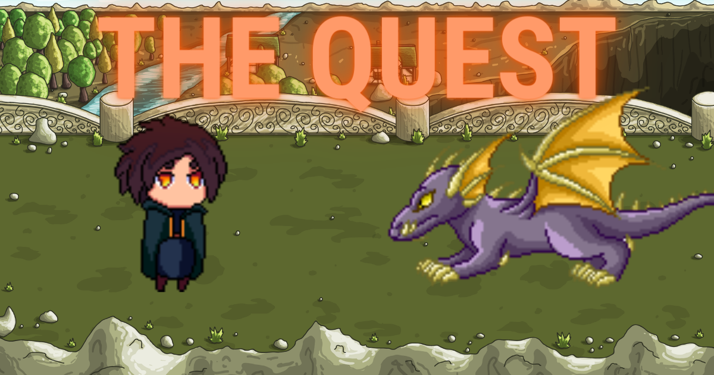

<br/>
<p align="center">
  <a href="https://github.com/leN43/theQuest">
    
  </a>

  <h3 align="center">README</h3>

  <p align="center">
    TheQuest is a personnal project to iniate myself to game devlopment basics with ruby2d
    <br/>
    <br/>
  </p>
</p>
## About The Project
Made in 5 day a simple game 

## Built With

This app was built with Ruby on Rails

* [Ruby](https://ruby-doc.org/3.2.2/)
* [Ruby2D](https://www.ruby2d.com)

## Getting Started

This is an example of how you may give instructions on setting up your project locally.
To get a local copy up and running follow these simple example steps.


### Installation

1. Clone the repo

```sh
git clone https://github.com/leN43/theQuest.git
cd theQuest
```
2. open the window `.env`

```ruby
ruby game.rb
```
## The Game
You can move the magician using the left , right up and down key
You can fire a fireball by pressing th space bar
When you kill the dragon ,you won ! Then the windows closes

## What I Learned
This project was made to learn the basics of both ruby2D and game development, I learned ;
* Settings up basic window Dimensions
* Parsing and colision Management
* Movements Mangement
  
## What could be improved
* Addind many levels
* Enemy attacts
* Enemy colision causes loss in health bar
